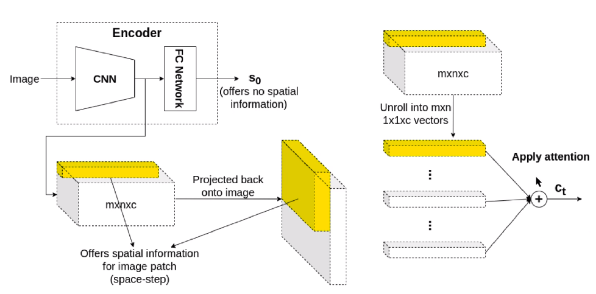

# Salient Object Detection

**Updated:** 13/12/2022
## Table of Contents

---

## B. Image Segmentation Approaches

### B.1 Fully Convolutional Networks (FCN) [link](https://arxiv.org/pdf/1411.4038.pdf)
- Apply upsampling on the downsampled image after the convolutional network. Essentially a global average pooling of the entire image
- Paper found that they could refine the fully convolutional nets by fusing information from layers with different strides improves segmentation detail 

    
- To better improve the precision, utilizes skip connections to further refine image segmentation
    
  
### B.2 Pyramid Parsing Network [link](https://arxiv.org/pdf/1612.01105.pdf)
- FCN has issues with complex scene parsing
  - **Mismatched relationships:** Lack of the ability to collect contextual
information increases the chance of misclassification (cars on road; planes in sky)
  - **Confusion of categories:** Unable to distinguish between similar objects (hill, mountain) partly due to misclassification of original dataset
  - **Inconspicuous classes:** Extremely small or large objects can be misclassified as they either cannot be detected or fall outside detection boundary
- Improves on FCN by creating feature maps in different levels flattening them and contatenating them into a single layer to be fed into a fully connected layer
- Reduces the problem of global context using a maxpooling solution
    
- Other useful links
  - [Spatial Pyramid Pooling](https://www.youtube.com/watch?v=2IoHC_fhrFU)
  - [Spatial Pyramid Matching](https://www.youtube.com/watch?v=6MwuK2wHlOg)

### B.3 PP-Matting [link](https://arxiv.org/pdf/2204.09433.pdf)
- Consist of 2 branches to deal with the issue of the lack of a given trimap:
  - Semantic context branch (SCB):- 
    - SCB consists of five blocks with each block consists of three ConvBNReLU (convolution, batch normalization (BN) and Rectified Linear Unit (ReLU)) and one bilinear upsample
  - High resolution detail branch (HRDB):- produces a detail map that focuses on details representation in the transition region (edges)
  - Fusion of both outputs produces final alpha matte
  
  

### B.4 High-Resolution Salient Object Detection[link](https://ieeexplore.ieee.org/document/9361432)
  - DRFNet includes a shared feature extractor and two refinement heads.
  - 
  - HRSOD approach uses a shared feature extractor and 2 refinement heads (global aware feature pyramid & hybrid dialation blocks)
  
  1. **Shared feature extractor**
  2. **Detail refinement head (DRH)** - low level information
    - **Convolutional Feature Reduction Block (CFRB):** 32x [1×1 convolutional layer followed by Batch Normalization (BN) and Rectified Linear Unit (ReLU)]
    - **Depth-Wise Feature Upsampling Block (DFUB):** Ensures the same resolution and retention of  the semantic information even after downsampling
    - **Global-Aware Feature Interaction Block (GFIB):** perform a Global Average Pooling (GAP) on the concatenated features of the CFRB and DFUB.
  
      
  3. **Context refinement head (CRH)** - high level information
    - **Hybrid Dilation Convolutional Block (HDCB):** use dilation in the range of (1,3,6,9) to cover kernel size
  
      
    - **Group-Wise Upsampling:** deconvolutions with different upsampling rates (1, 2, 4, 8, 16) are applied to the five scale features alternately
    - 
  4. **Guided Feature Boosting (GFB)**
    - Uses concatenated features from global feature map DRH and CRH to perform feature reduction via convolutional layer
    

Exising
  

--- 
## C. Image Segmentation Approaches: Transformer Based

### C.1 PiCANet [link](https://openaccess.thecvf.com/content_cvpr_2018/papers/Liu_PiCANet_Learning_Pixel-Wise_CVPR_2018_paper.pdf)
  - Pixel wise attention layer consist of a local and global layer
  - Global layer: 
    - ReNet - (4 RNN) biLSTM (L-R) followed by biLSTM (T-B)
    - 
  - Local layer:
  
  - Hard vs soft attention
    - Hard attention: single position (bbox) chosen for full alignment, either in or out
    - Soft attention: attributing a probability score (0-1)
    - Global attention: attention on the entire image
    - Local attention: attention on certain parts of the image (Neighbourhood window)
    - self-attention (intra-attention): 
  - Based on the kernel size where should the model pay attention to?
  

### C.2 Reverse Attention for Salient Object Detection [link](https://arxiv.org/pdf/1807.09940.pdf)
- side output feature 
- Uses reversed attention blocks, (different from reverse attention network). 
  
  

---
## Glossary

- Trimap:
  - partition of the image into three regions: 
  - Definite foreground, 
  - Definite background, 
  - Blended region where pixels are considered as a mixture of foreground and background colors

---
## Helpful links

- An overview of semantic image segmentation [link](https://www.jeremyjordan.me/semantic-segmentation/)

